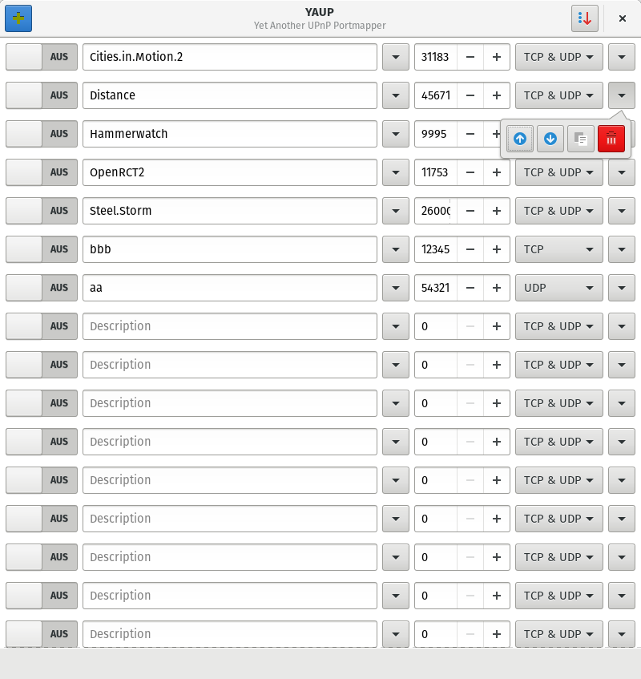
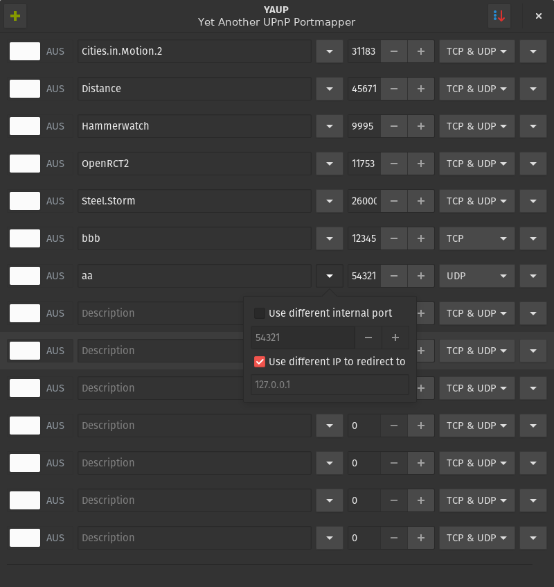

# Yaup - Yet Another UPnP Portmapper
Portmapping made easy.

Portforward your incoming traffic to a specified local ip.
Mostly used for IPv4.

## Table of Contents
1. [Features](#features)
2. [How to do things with this code](#how-to-do-things-with-this-code)
    1. [Dependencies](#dependencies)
    1. [How to build](#how-to-build)
    2. [How to install](#how-to-install)
    2. [How to uninstall](#how-to-uninstall)

3. [Screenshots](#screenshots)
4. [Troubleshooting](#troubleshooting)
    1. [Q: Why another portmapper?](#q-why-another-portmapper)
    2. [Q: This doesn't work!](#q-this-doesnt-work)
    3. [Q: There is a bug!](#q-there-is-a-bug)
    4. [Q: This is missing a new cool feature!](#q-this-is-missing-a-new-cool-feature)
    5. [Q: You ass can't spell shit!](#q-you-ass-cant-spell-shit)
    6. [Q: I love your dark theme!](#q-i-love-your-dark-theme)

## Features
* Linux!
* A list with your different portforwardings, activated or not!
* Choose the protocol!
* Sortable list!
* Move entries around!
* Activate an entry for an IP different than yours!
* Different local port!
* Add list entries!
* Delete list entries!
* Duplicate list entries!
* Choose the router you want to change!
* What are you still doing here? Build, install and use it!

## How to do things with this code
### Dependencies
You'll need `gtk3` and `miniupnpc` among the building tools.

### How to build
~~~
$ git clone https://github.com/Holarse-Linuxgaming/yaup.git
$ cd yaup
$ ./configure
$ make
~~~

### How to install
~~~
# make install
~~~

### How to uninstall
~~~
# make uninstall
~~~

##Screenshots

## Troubleshooting
### Q: Why another portmapper?
A: I haven't found an existing, nice looking, functioning and recent portmapper.

### Q: This doesn't work!
Is there a setting to allow changing your routers settings through UPnP in the
router webpanel?

A: Activate it.

### Q: There is a bug!
A: Open an issue.

### Q: This is missing a new cool feature!
A: Make a pull request.

### Q: You ass can't spell shit!
A: Make a pull request.

### Q: I love your dark theme!
A: [Numix-ArchBlue](https://aur.archlinux.org/packages/numix-themes-archblue-git/)
